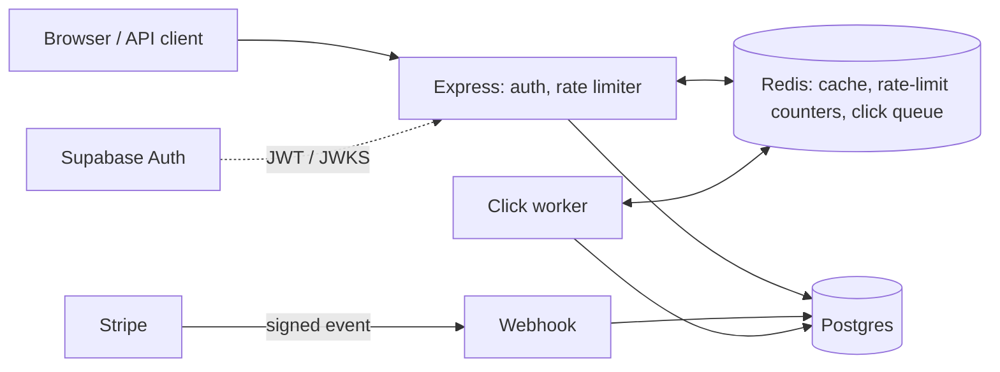

# REST-URL Pro

A link shortener SaaS: accounts, API keys, rate limits, click analytics and Stripe test-mode billing.

## Highlights

- Redirects served from Redis; click analytics written off the request path by a worker
- Crash-safe, idempotent click pipeline
- Sliding-window rate limiting per plan
- Idempotent Stripe webhook as the single source of truth for plans
- Postgres RLS and hashed API keys
- Redirect p50: 24 ms cached vs 33 ms uncached (local, see [docs/design.md](docs/design.md))

## Architecture



## Run it locally

```bash
docker compose up -d
cp backend/.env.example backend/.env && cp frontend/.env.example frontend/.env   # then fill in
for f in backend/db/migrations/*.sql; do psql "$DATABASE_URL" -v ON_ERROR_STOP=1 -f "$f"; done
(cd backend && npm install && npm run dev)       # API :3000
(cd backend && npm run worker)                   # click worker
(cd frontend && npm install && npm run dev)      # app :5173
```

Full setup, env vars and Stripe: [docs/setup.md](docs/setup.md)

## Docs

- [docs/setup.md](docs/setup.md): setup, env vars, Stripe, tests
- [docs/api.md](docs/api.md): endpoints, auth, rate limits
- [docs/design.md](docs/design.md): decisions, benchmark, limitations

## Why I built it

<!-- TODO(you): write this section -->
